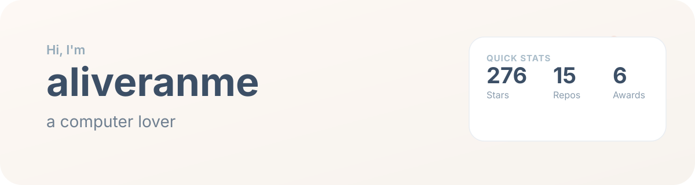
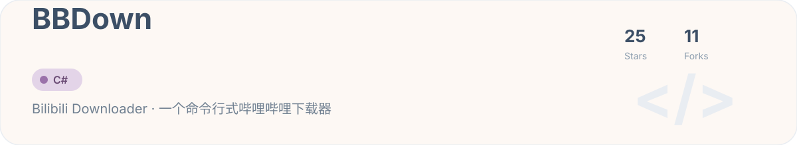
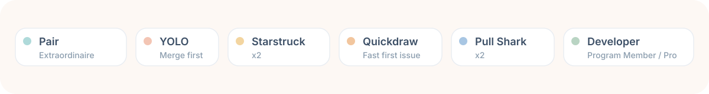

  

  

## 👋 关于我

我是 **aliveranme**，坐标 **北京**，目前在 **中央民族大学**（Minzu University of China）学习/工作。热爱计算机、自动化工具和实用的开发者小玩具。

- 🔭 最近关注：命令行工具、下载/自动化脚本
- 🌱 一直在学习新技术，喜欢边做边学
- 💬 欢迎聊聊 CLI 工具、开源项目或者自动化工作流
- ⚡ 座右铭：让代码解决重复劳动

  

  
  
  
  
  
  
  
  
  
  

> 上面的技能标签订可随时在 `README.md` 里增删，只需替换 shield 中的 `logo` 和颜色即可。

## 📊 GitHub 概览

  
  
  

## 🚀 精选项目

  

[Bilibili Downloader](https://github.com/aliveranme/BBDown) — 一个命令行式哔哩哔哩下载器，fork 自 [nilaoda/BBDown](https://github.com/nilaoda/BBDown)。

## 🏆 成就

  

  

  

  

> 以下组件需要你额外配置对应服务或 GitHub Action；未配置前会显示示例图或空白，按说明接入后即可自动刷新。

### 🌇 3D 贡献图

  

启用 3D 贡献图

参考 [github-profile-3d-contrib](https://github.com/yoshi389111/github-profile-3d-contrib)，在 `aliveranme/aliveranme` 仓库配置 GitHub Action，让它定时生成 `profile-3d-contrib/profile-green-animate.svg` 并提交到 `main` 分支即可。

### 🏙️ GitHub Skyline

  

### 🐍 动态贡献贪吃蛇

  

启用贪吃蛇动画

参考 [Platane/snk](https://github.com/Platane/snk) 配置 GitHub Action。它会根据你的贡献网格生成 `github-contribution-grid-snake.svg`，默认输出到 `output` 分支。你也可以选用 dark/light 配色或生成 GIF。

### 🎵 Spotify 正在播放 / 最近听过

  

接入 Spotify

按 [spotify-github-profile 文档](https://github.com/kittinan/spotify-github-profile) 在 Vercel 部署自己的端点并拿到 `refresh_token`，然后把图片 URL 替换为你的个人端点即可。如果只想展示“最近播放”，也可换成 [spotify-recently-played-readme](https://github.com/JeffreyCA/spotify-recently-played-readme)。

### 📻 Last.fm 最近听过

  

接入 Last.fm

把 `YOUR_LASTFM_USERNAME` 替换为你的 Last.fm 用户名。服务来自 [JeffreyCA/lastfm-recently-played-readme](https://github.com/JeffreyCA/lastfm-recently-played-readme)。

### ⏰ WakaTime 编码统计

  

接入 WakaTime

1. 在 [WakaTime](https://wakatime.com) 注册并安装编辑器插件。
2. 进入 WakaTime → Settings → Privacy，开启 “Display coding activity publicly”。
3. 若 `username` 方式无法显示，可使用 WakaTime 的公开 Share URL，替换掉上方的 `img src`。

## 📫 联系我

- GitHub: [@aliveranme](https://github.com/aliveranme)
- 如想交流合作，欢迎在仓库里提交 Issue 或 Discussion。

  

