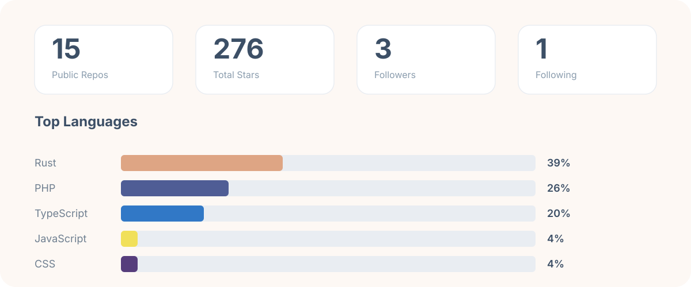

  

  

## 关于我

我是 **aliveranme**，一名热爱计算机、自动化工具和实用开发者小玩具的 builder。

- 最近关注：命令行工具、下载/自动化脚本
- 一直在学习新技术，喜欢边做边学
- 欢迎聊聊 CLI 工具、开源项目或者自动化工作流
- 座右铭：让代码解决重复劳动

  

  
  
  
  
  
  
  
  
  
  

## GitHub 概览

  

## 精选项目

  

[Bilibili Downloader](https://github.com/aliveranme/BBDown) — 一个命令行式哔哩哔哩下载器，fork 自 [nilaoda/BBDown](https://github.com/nilaoda/BBDown)。

## 成就

  

  

  

  

> 以下动态组件已配置 GitHub Actions 自动刷新。

### 3D 贡献图

  

### 动态贡献贪吃蛇

  

## 联系我

- GitHub: [@aliveranme](https://github.com/aliveranme)
- 如想交流合作，欢迎在仓库里提交 Issue 或 Discussion。

  

